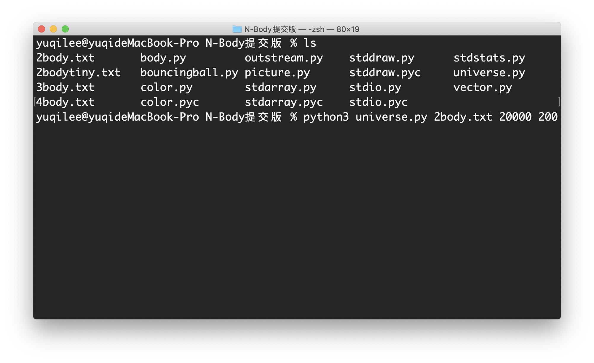
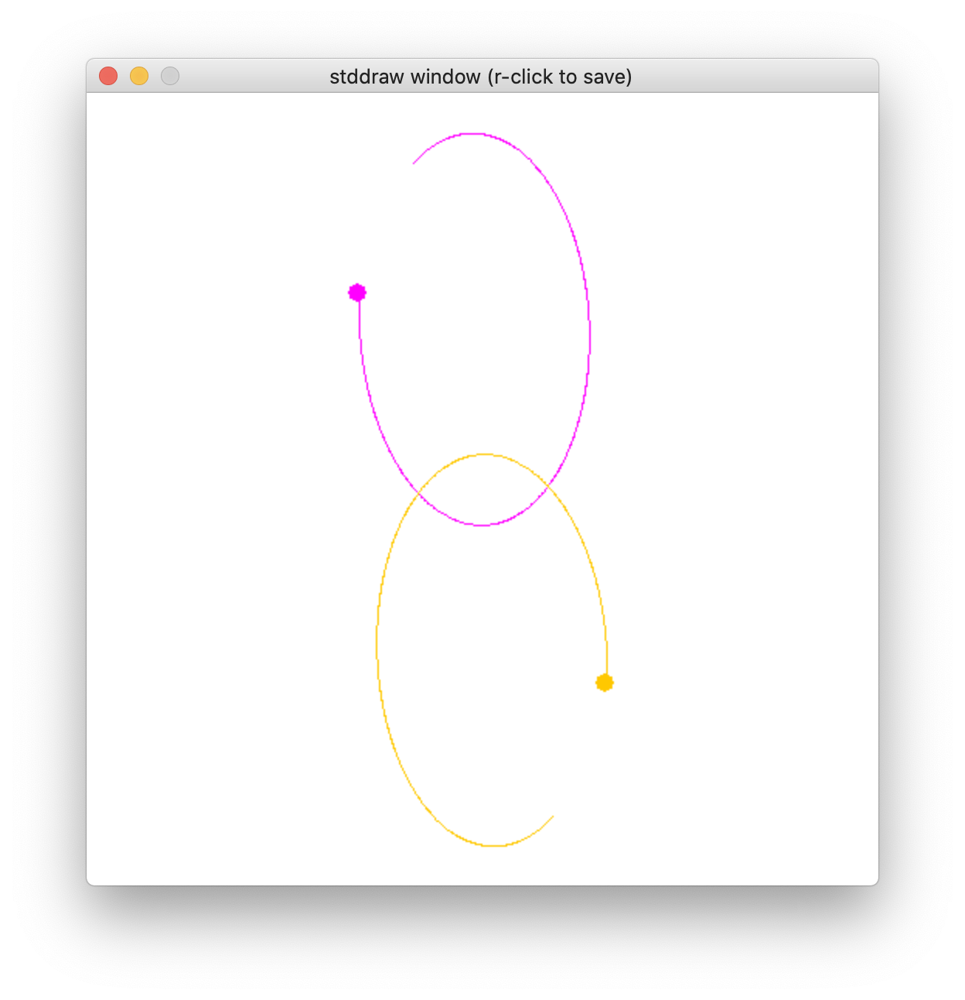
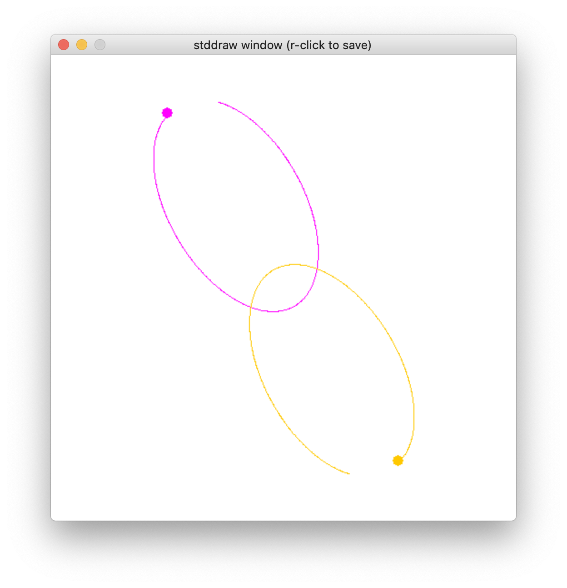
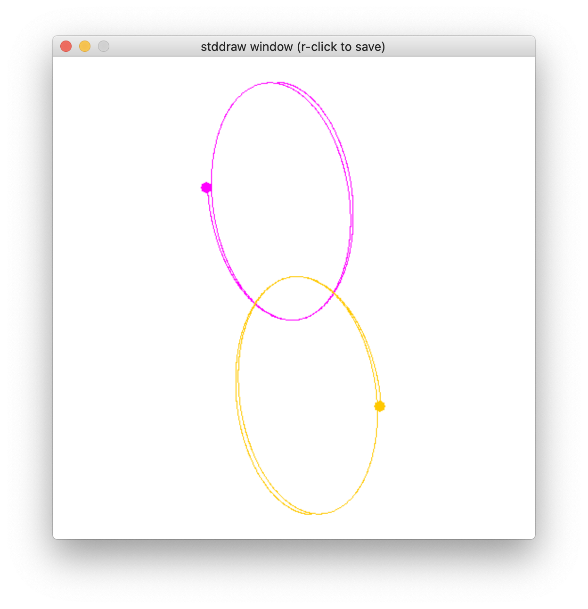
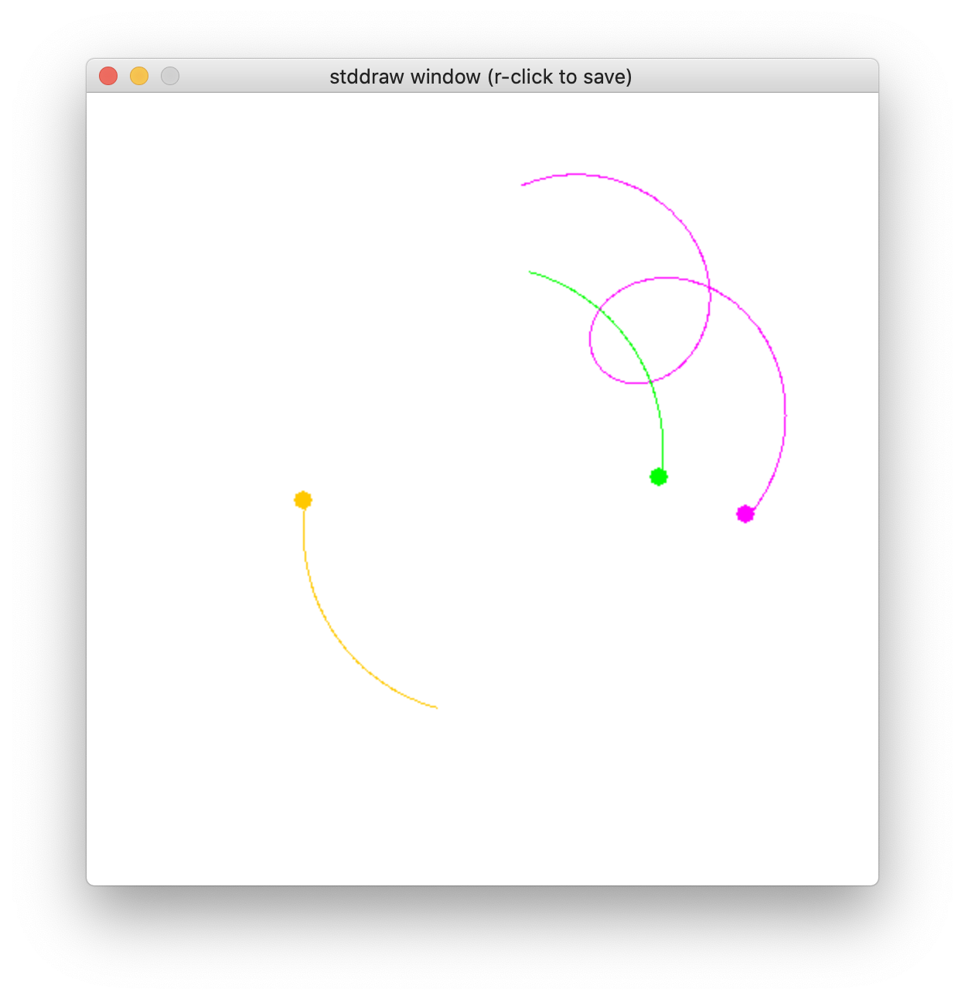
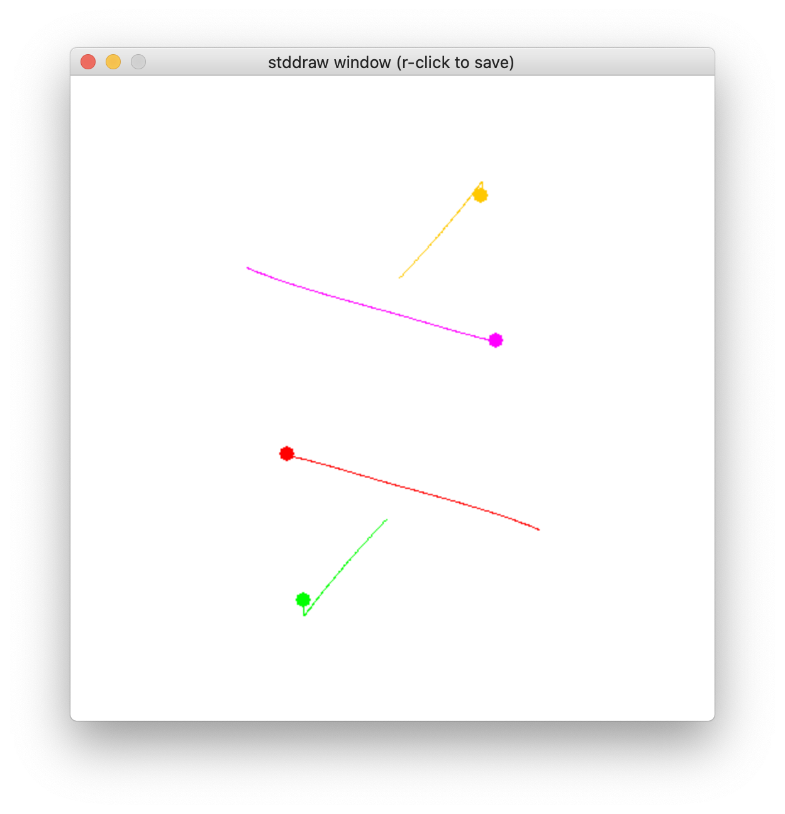
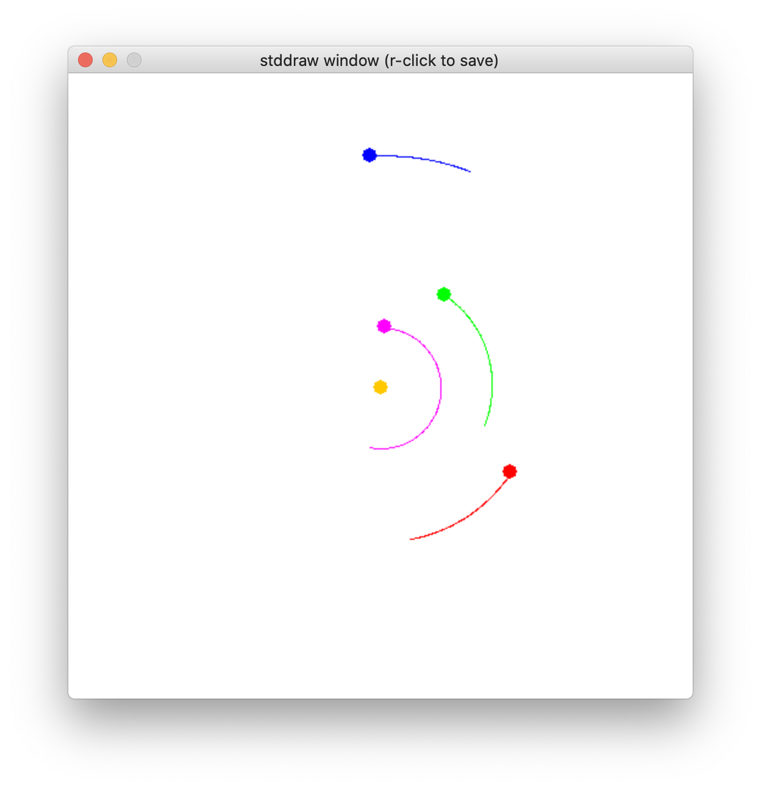

# N-Body

## 实验目标
* 熟悉 Python 基本语法
* 掌握 OOP 编程的基础方法
* 利用 OOP 编程，求解 N 体问题的数值解，并通过 pygame 进行动画展示

## 问题描述
N 体问题是指找出已知初始位置、速度和质量的多个物体在经典力学情况下的后续运动。在本实验中，只考虑二维平面的 N 体问题，给定多个小球的初始位置坐标，速度和质量，它们相互之间只有万有引力作用，求在以后的时间里每个小球的运动状态

## 设计思路
1. 本次实验为 N 体模拟实验，所有的星球可以抽象成为一个类（class Body）；
2. 需要一个顶层模块，来计算各个星球之间的作用力、等，故设计了宇宙类（class Universe）；
3. 此外，力、加速度、速度、位移（位置坐标）都具有矢量的特性，从其中再抽象出一个矢量类（class Vector），可以减少代码的重复，便于后续进行修改、维护


## 代码介绍
* 宇宙类（in universe.py)  
根据本次设计的抽象，universe 类相当于一个起到链接作用的类，因此它需要实现数据交换的接口（直接把构造函数设计为读取文件数据）；宇宙类内部需要构造多个星球对象，并控制、更新它们之间的相互作用情况、自身运动情况，以此达到仿真的效果；它还要调用自身的 body 成员的 draw()函数，来做出动画图像

```
class Universe:

    # 读取文件数据，建立一个新的宇宙对象
    def __init__(self, filename):
        instream = InStream(filename)
        n = instream.readInt()
        radius = instream.readFloat()
        stddraw.setXscale(-radius, +radius)
        stddraw.setYscale(-radius, +radius)
        self._bodies = stdarray.create1D(n)
        for i in range(n):
            rx = instream.readFloat()
            ry = instream.readFloat()
            vx = instream.readFloat()
            vy = instream.readFloat()
            mass = instream.readFloat()
            r = Vector([rx, ry])
            v = Vector([vx, vy])
            self._bodies[i] = Body(r, v, mass)


    # 每过 dt 时间，更新自身数据.
    def increaseTime(self, dt):
        # 初始化受力值为 0
        n = len(self._bodies)
        f = stdarray.create1D(n, Vector([0, 0]))

        # 计算受力.
        for i in range(n):
            for j in range(n):
                if i != j:
                    bodyi = self._bodies[i]
                    bodyj = self._bodies[j]
                    f[i] = f[i] + bodyi.forceFrom(bodyj)

        # 移动星球
        for i in range(n):
            self._bodies[i].move(f[i], dt)

    # 画出所有的星球 
    def draw(self,trackn): 
        for body in self._bodies: 
            body.draw(trackn)    
            
            
 
```


* 星球类（in body.py)  
除了构造函数外，实现了move()、forceFrom()、draw() 三个函数接口，与 Unverse 类配合使用

```
class Body:
	
	count = 0;
 
    # 创建新星球时，给出星球的质量，以及初始位置，速度（这两者都为矢量）
    def __init__(self, r, v, mass):
        self._r = r        # Position
        self._v = v        # Velocity
        self._mass = mass  # Mass
        self._posi=[self._r]
        self._color=stddraw.colors[Body.count%stddraw.colorsn]
        Body.count+=1

    # 根据自身受力情况，每 dt 时间更新加速度、速度、位置
    def move(self, f, dt):
        a = f.scale(1 / self._mass)
        self._v = self._v + (a.scale(dt))
        self._r = self._r + self._v.scale(dt)

    # 返回自己与另一个同类的实例对象之间的相互作用力大小
    def forceFrom(self, other):
        G = 6.67e-11
        delta = other._r - self._r
        dist = abs(delta)
        magnitude = (G * self._mass * other._mass) / (dist * dist)
        return delta.direction().scale(magnitude)

    # 画出自己，以及之前最多 trackn 个点所构成的尾迹
    # (由于实际上的模拟是非连续的，每隔 dt 时间更新位置，所以可以根据过往位置画尾迹)
    def draw(self):
        stddraw.setPenColor(self._color)
        stddraw.setPenRadius(0.0125)
        stddraw.point(self._r[0], self._r[1])
        if trackn<1:
            trackn=1
        n=len(self._posi)
        if n<trackn:
            self._posi.append(self._r)
        if len(self._posi)>=trackn:
            del self._posi[0]
        stddraw.setPenRadius(0.0125)
        for i in range(n-1):
            stddraw.line(self._posi[i][0], self._posi[i][1], \
            self._posi[i+1][0], self._posi[i+1][1])
```


* 向量类（in vector.py)

直接使用网站上所提供的 vector.py 来实现。自己阅读了源码，了解了其中各个成员函数的功能以及实现原理。向量类提供了关于二维矢量的加减法、数乘、内积、求模等许多功能。本次实验实际只需要使用到其中的一个子集

```
class Vector:

    
    # 利用数组 a 中给出的坐标，建立一个向量
    def __init__(self, a):
        # Make a defensive copy to ensure immutability.
        self._coords = a[:]   # Cartesian coordinates
        self._n = len(a) # Dimension.

    # 返回自身的 x 坐标，或者 y 坐标
    def __getitem__(self, i):
        return self._coords[i]

    # 计算自己与另一个同类对象实例之和
    def __add__(self, other):
        result = stdarray.create1D(self._n, 0)
        for i in range(self._n):
            result[i] = self._coords[i] + other._coords[i]
        return Vector(result)

    # 计算自己与另一个同类对象实例之差
    def __sub__(self, other):
        result = stdarray.create1D(self._n, 0)
        for i in range(self._n):
            result[i] = self._coords[i] - other._coords[i]
        return Vector(result)

    # 计算自己与一个实数之积
    def scale(self, alpha):
        result = stdarray.create1D(self._n, 0)
        for i in range(self._n):
            result[i] = alpha * self._coords[i]
        return Vector(result)

    # 计算自己与另一个同类对象实例之内积
    def dot(self, other):
        result = 0
        for i in range(self._n):
            result += self._coords[i] * other._coords[i]
        return result

    # 返回自己的模，通过自己与自己进行点乘后开方得到
    def __abs__(self):
        return math.sqrt(self.dot(self))

    # 返回与自身同向的单位向量
    def direction(self):
        return self.scale(1.0 / abs(self))

    # 返回自己的坐标（以字符串 string 形式表示）
    def __str__(self):
        return str(self._coords)
        
    # 返回自己的维度.
    def __len__(self):
        return self._n

```


## 优化显示 
上述代码的设计思路以及实现主要基于网站上给出的源码实现。除了给出的三个类外，输入/输出、画图等功能也是直接使用了网站给出的模块来完成。为了优化显示效果，比如展示星球的运动轨迹，主要对网站上的代码做以下修改： 

* 使用 stddraw.py 中的 line() 函数依次连接小球此前的若干个位置坐标来绘制轨迹，修改了星球类（class Body）的构造函数以及 draw() 函数）

	```
	(Body 类的 draw() 函数中)
	for i in range(n-1):
      		stddraw.line(self._posi[i][0], self._posi[i][1],\
      		 self._posi[i+1][0], self._posi[i+1][1])
	```


* 用不同的颜色来绘制每个小球。为此，对 stddraw.py 文件内容做了修改，加入了两行代码： 


	```
	# 定义颜色
colors = [MAGENTA,ORANGE,GREEN,RED,BLUE,YELLOW,PINK,BLACK,VIOLET]
colorsn = len(colors)

	```
	其中 MAGENTA、ORANGE、GREEN…… 是在文件 color.py 中定义的变量，它们已经在该文件中根据 RGB 调好相应的颜色
	
* 在星球类（class Body）中增加了**类变量** count，来对每个星球实例对象赋予不同的尾迹颜色。具体可参考以下代码：


	```
	(Body 类的构造函数中）
	self._color = stddraw.colors[Body.count%stddraw.colorsn]
	Body.count += 1
	```
	9 种颜色会被循环使用
	

	

## 结果展示

 根据本次实验的设计层次，main() 函数应该首先通过数据文件，构造一个 Unverise 类的对象；之后由  Universe 类的接口来完成 N 体运动的模拟。main() 函数代码如下：
  
```
def main(): 
    filename = sys.argv[1]
    dt = float(sys.argv[2])
    trackn = float(sys.argv[3])
    universe = Universe(filename)
    while True:
        universe.increaseTime(dt)
        stddraw.clear()
        universe.draw(trackn)
        stddraw.show(10)
```

从命令行执行程序，采用测试数据集 2body.py ，参数 dt 与 trackn 分别设为合适值 20000 与 200：
	
stddraw 画图效果如下： 
	 
发现该测试集中整个系统在逆时针旋转。于是我修改了尾迹长度，把参数 argv[3] 设为 400，继续观察：
	
	可以发现上方星球的运动轨迹明显向左偏，下方星球则向右偏。通过改变参数，可以实现不同的模拟需求  
	
采用测试数据集 3body.txt，截图如下：
	
	
采用测试数据集 4body.txt，截图如下：
	
可以发现，四体测试集的模拟动画具有良好的对称性

此外，我自己设计了一个测试集，用于模拟太阳系前 4 个行星以及太阳的运动情况，所用数据均为真实数据，截图如下：
	
具体测试数据为文件 real_universe.txt，与代码打包在一起


